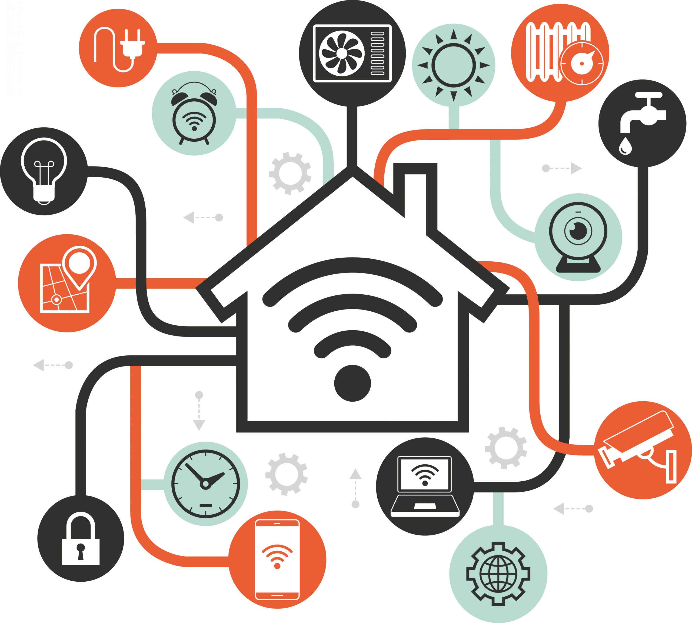

# Умный дом "SmartHouse"

**Автор:** Р.Р. Кистаубаев (krr006)

**Описание:** "SmartHouse" - это веб-приложение для умного дома, разработанное для упрощения жизни и создания комфортных условий. Приложение позволяет пользователям контролировать и автоматизировать различные аспекты своего дома, такие как освещение, климат, безопасность и многое другое. Независимо от того, где вы находитесь, вы можете управлять вашим умным домом через веб-интерфейс и мобильное приложение.

### Основные функции:

- **Удаленное управление освещением и электроникой:** Включайте и выключайте свет, музыку и другие устройства даже в вашем отсутствии.

- **Настройка графика климат-контроля:** Создавайте удобные климатические условия, регулируя температуру и влажность в вашем доме.

- **Мониторинг системы безопасности:** Будьте в курсе происходящего в вашем доме с помощью камер и сигнализации.

- **Уведомления о событиях в доме:** Получайте немедленные уведомления о важных событиях, таких как взлом или аварийная ситуация.

- **Интеграция с голосовыми помощниками:** Голосовое управление вашим домом с использованием популярных голосовых помощников, таких как Alexa и Google Assistant.

## Технологии и стек

- **Backend:** Python, Django
- **Frontend:** HTML, CSS, JavaScript
- **База данных:** SQLite
